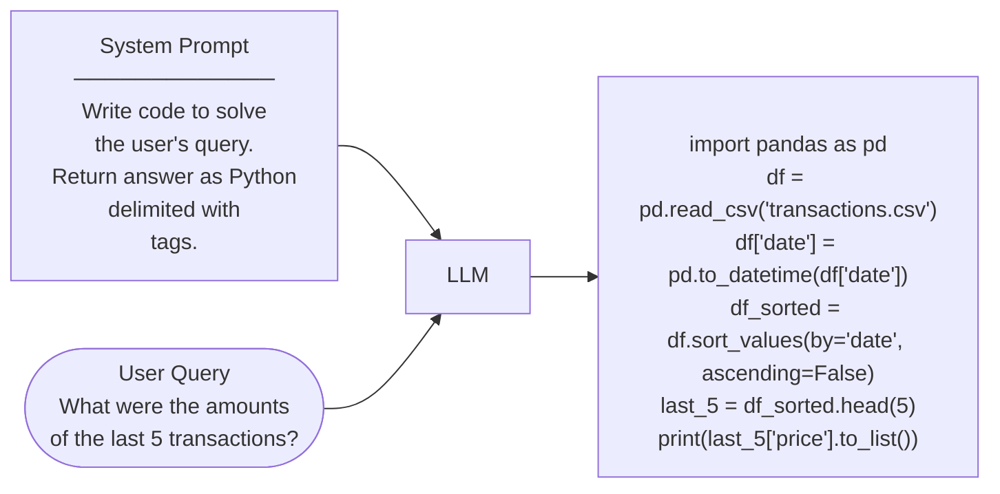
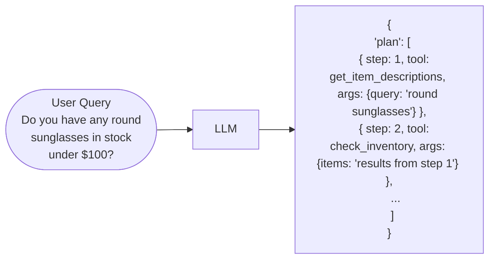
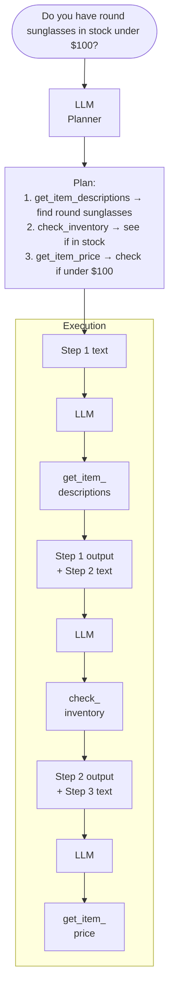

# Autonomous Agent Planning

> Source: DeepLearning.AI · Andrew Ng + personal notes

---

## What is Autonomous Planning?

In agentic systems, the LLM doesn't just answer — it **generates a step-by-step plan** and executes it autonomously using tools. The agent decides:
- What steps are needed
- Which tool to call at each step
- What args to pass, based on previous step outputs

---

## Planning with Code Execution

LLM generates executable code as its "plan" to answer a query.

---

## Formatting Plan as JSON

Instead of free text, the LLM returns a **structured JSON plan** — each step has a tool name + args, making it machine-parseable and executable.

**System prompt instructs:**
> "Create a step-by-step plan in JSON format. Each step should have: step number, description, tool name, and args."

**Why JSON?**
- Machine-readable → executor can loop over steps automatically
- Each step references previous step's output
- Separates planning from execution

---

## Example: Customer Service Agent

Full autonomous planning + execution flow with multiple tools.

**Available tools:** `get_item_descriptions`, `check_inventory`, `process_item_return`, `get_item_price`, `check_past_transactions`, `process_item_sale`

**Key insight:** Each step feeds its output into the next LLM call — the agent chains tool results together autonomously.

---

## Key Takeaways

- Autonomous planning = LLM generates a plan (code or JSON), then executes it step by step
- Plan can be **code** (flexible, powerful) or **JSON** (structured, easier to parse + control)
- Each execution step passes previous output as context to the next LLM call
- The system prompt defines available tools + output format of the plan
- Agent picks the right tool per step based on the plan it generated
