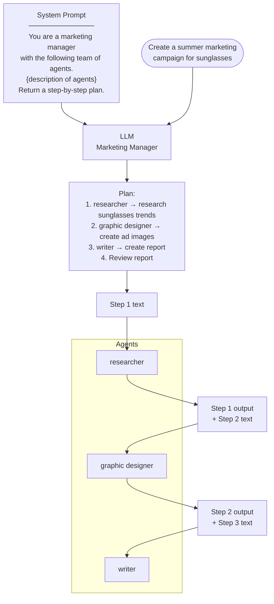
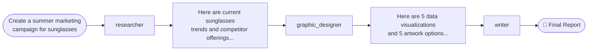

# Multi-Agent Planning

> Source: DeepLearning.AI · Andrew Ng

---

## What is Multi-Agent Planning?

Instead of one LLM doing everything, a **manager LLM** creates a plan and delegates each step to **specialist sub-agents**. Each agent has its own role, tasks, and tools.

---

## Planning with Multiple Agents

**Key:** Each step passes previous output as context to the next agent.

---

## Linear Execution: Marketing Team Example

---

## Agent Roles & Tools

| Agent | Tasks | Tools |
|-------|-------|-------|
| **Researcher** | Analyze market trends, research competitors | Web search |
| **Graphic Designer** | Create data visualizations, create artwork | Image generation, image manipulation, code execution (charts) |
| **Writer** | Transform research into report text and marketing copy | None |

---

## Key Takeaways

- Manager LLM acts as **orchestrator** — plans and delegates, doesn't execute
- Each sub-agent is specialized with its own system prompt + tools
- Outputs chain linearly: each agent's output becomes the next agent's input
- This is a **linear plan** — steps are sequential, not parallel
- More complex plans can have branching or parallel execution
