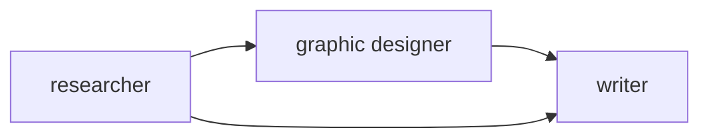
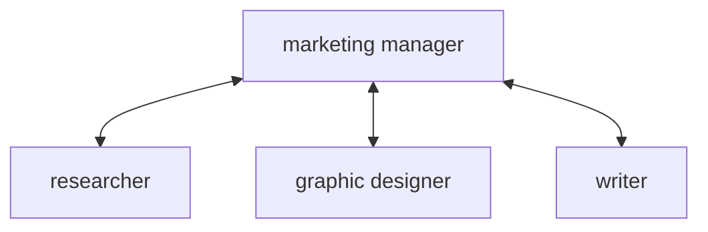
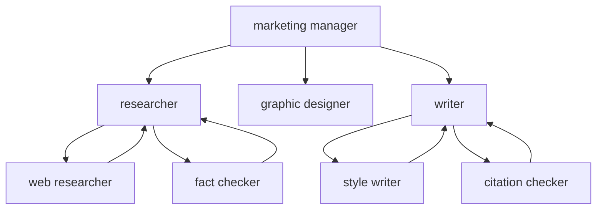
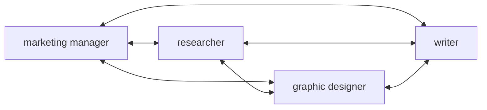

# Agent Communication Patterns

> Source: DeepLearning.AI · Andrew Ng

---

## Overview

How agents communicate with each other determines the **flexibility, complexity, and coordination** of a multi-agent system. Different patterns suit different tasks.

---

## Pattern 1: Linear

Agents pass outputs sequentially — each agent feeds directly into the next.

- Simple and predictable
- Output of each step becomes input of the next
- Researcher can also pass directly to writer (skip graphic designer if needed)
- Used in: Marketing team linear plan

---

## Pattern 2: Hub and Spoke (Manager)

A central manager agent coordinates all sub-agents — delegates tasks and collects results.

- Manager is the single point of control
- Sub-agents don't talk to each other directly
- Manager decides what to delegate and when
- Good for: coordinated, dependent tasks

---

## Pattern 3: Deeper Hierarchy

Sub-agents can themselves have sub-agents — creating a tree of agents.

- Manager delegates to mid-level agents
- Mid-level agents further delegate to specialists
- More scalable for complex tasks
- Harder to debug and trace

---

## Pattern 4: All-to-All

Every agent can communicate with every other agent — fully connected mesh.

- Maximum flexibility — any agent can ask any other for help
- Can lead to complex, hard-to-predict interactions
- Good for: collaborative tasks where agents need to cross-reference each other

---

## Comparison

| Pattern | Structure | Flexibility | Complexity | Best For |
|---------|-----------|-------------|------------|----------|
| Linear | Sequential chain | Low | Low | Simple pipelines |
| Hub & Spoke | Manager + sub-agents | Medium | Medium | Coordinated delegation |
| Deeper Hierarchy | Tree of agents | Medium | High | Large, complex tasks |
| All-to-All | Fully connected | High | Very High | Collaborative tasks |

---

## Key Trade-off: Flexibility vs Control

> **Increased flexibility allows broader task coverage but reduces predictability and control over agent actions and outcomes.**

- More flexible patterns (all-to-all, deeper hierarchy) = agents can handle a wider range of tasks
- BUT: harder to predict what agents will do, harder to debug, less direct developer control
- Simpler patterns (linear) = more predictable and controllable, but narrower task coverage
- **Common mistake:** thinking flexibility *improves* developer oversight — it actually does the opposite

---

## Quiz Insight: Hierarchical vs All-to-All

When **one agent coordinates the work of others** (e.g. Code Reviewer directing Documentation Writer and Deployment Agent) → that is **Hierarchical communication**, not all-to-all.

- All-to-all = every agent talks to every other agent freely (no single coordinator)
- Hierarchical = one agent acts as manager/coordinator directing sub-agents
