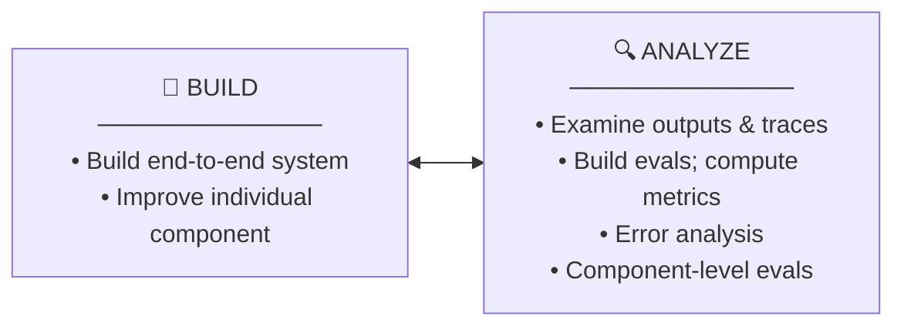
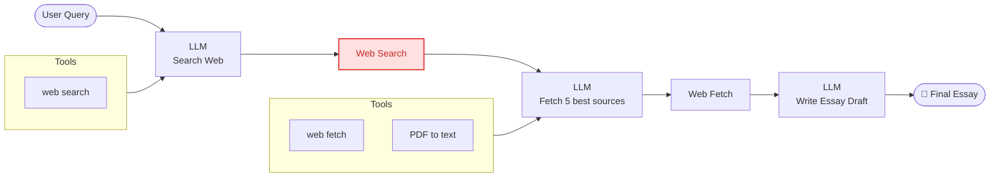
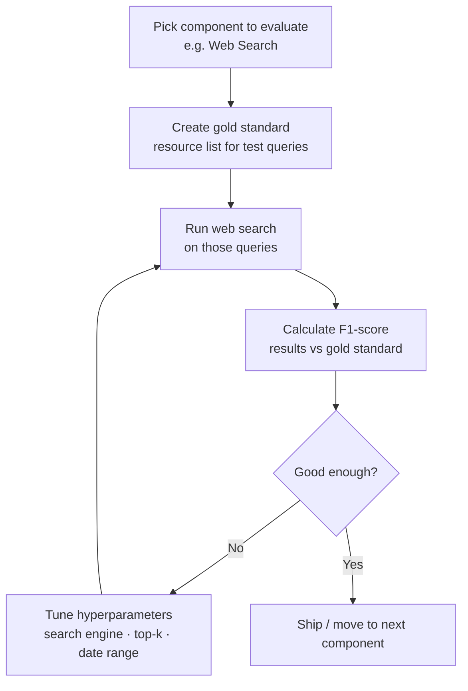

# Evaluating Agentic Systems — Component-Level Evaluation

> Source: DeepLearning.AI · Andrew Ng + personal notes

---

## Development Process Summary

The agentic system development cycle is **iterative** — Build and Analyze feed each other continuously.

---

## Research Agent Pipeline

> **Red box = component being evaluated in isolation**

---

## Why Component-Level Evaluation?

- **Overall (end-to-end) eval is important** and should always be in place
- Component-level eval **complements** the overall eval — it doesn't replace it
- End-to-end eval alone is expensive and time-consuming, and hard to pinpoint *which* component failed
- Component eval gives **clearer signal** for specific errors — avoids noise from the rest of the system
- More efficient: focused team can iterate on smaller, targeted problems faster

**Key habit:** Look at **traces** across different agentic components to find where errors occur

Use error analysis output to decide **where to focus your effort**

---

## Improving Non-LLM Components

| Component | Tune Hyperparameters | Replace |
|-----------|---------------------|---------|
| Web Search | Number of results, date range | Try different search engine |
| RAG | Similarity threshold, chunk size | Try different RAG provider |
| ML Models | Detection threshold | Swap model entirely |

---

## Improving LLM Components

| Strategy | How |
|----------|-----|
| Improve prompts | Add explicit instructions, few-shot examples |
| Try a new model | Run evals across multiple LLMs, pick best |
| Split the step | Decompose task into smaller subtasks |
| Fine-tune | Train on internal data for the specific task |

---

## Example: Evaluating the Web Search Tool

### Steps
1. **Gold standard** — curate a list of ideal web resources for a set of test queries
2. **Metric** — measure how many results match gold standard using **F1-score**
3. **Tune** — vary hyperparameters (search engine, top-k results, date range) and track the metric
4. **Repeat** per component

---

## Key Takeaways

- Complement your overall eval with **component-level evals**
- For each non-LLM component (web search, RAG retriever, ML model): build a mini eval with gold standard data
- For LLM components: use prompting → model swap → decomposition → fine-tuning, in that order
- Always track metrics as you vary hyperparameters — don't guess, measure
