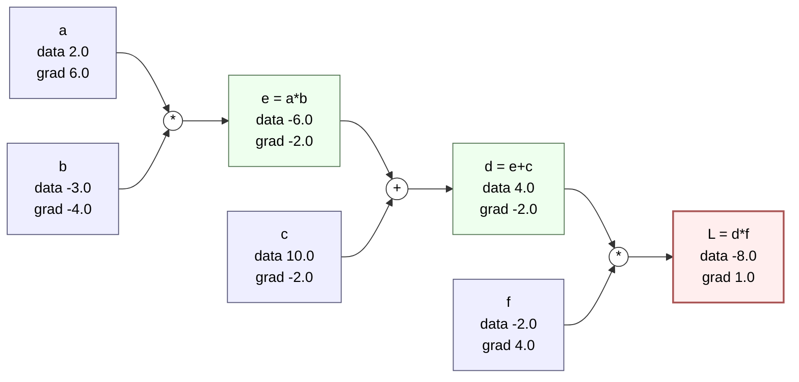
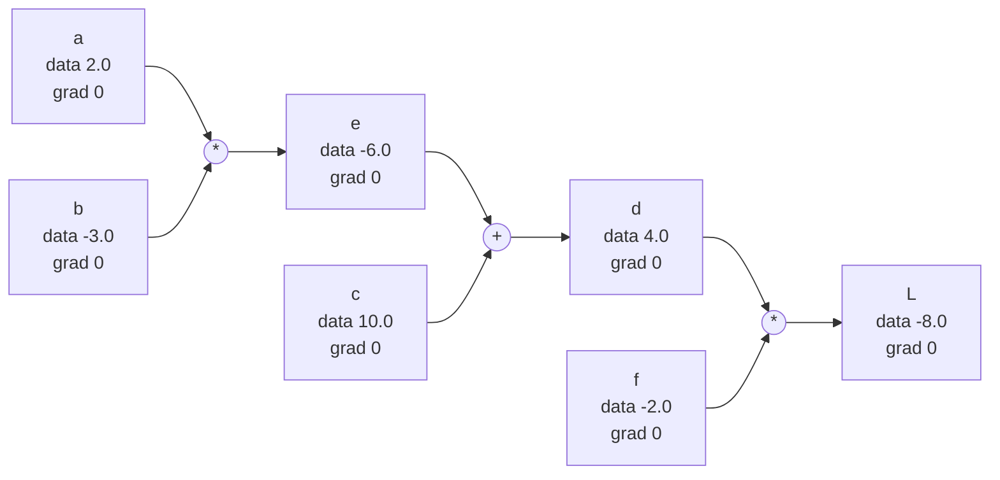
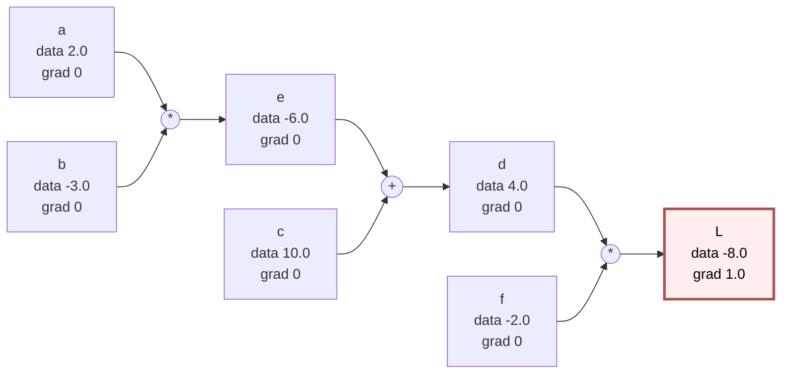
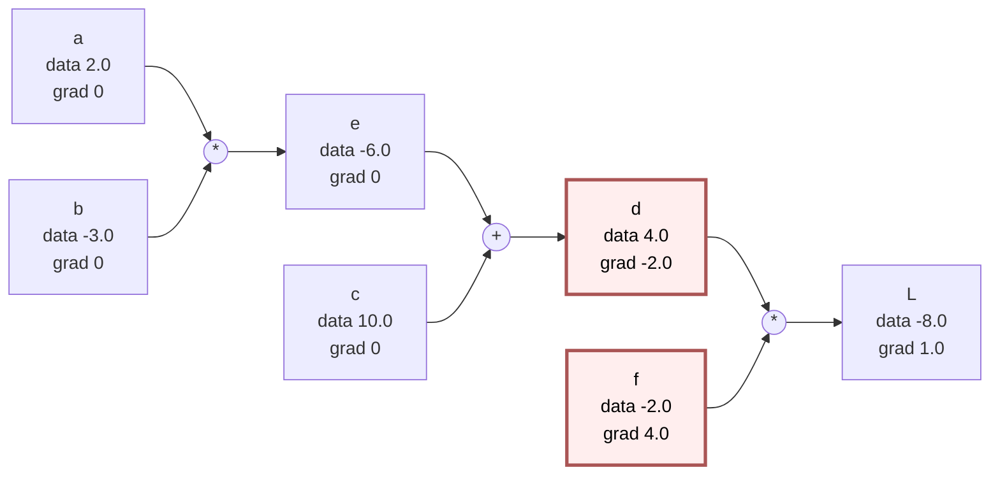
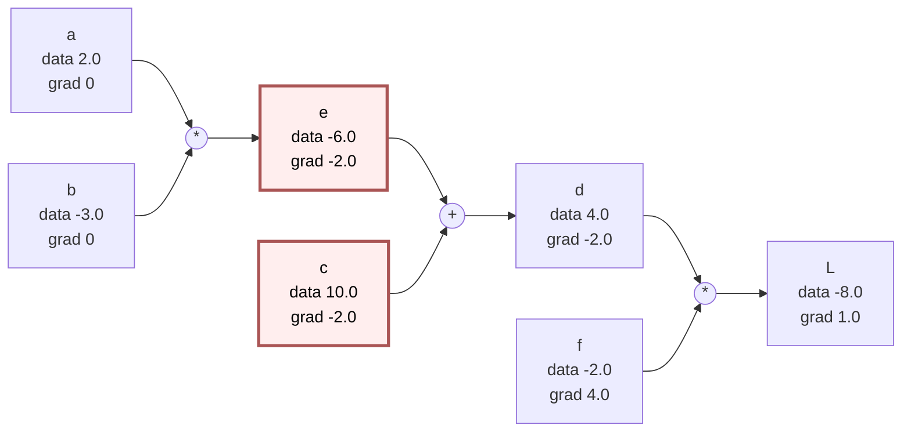
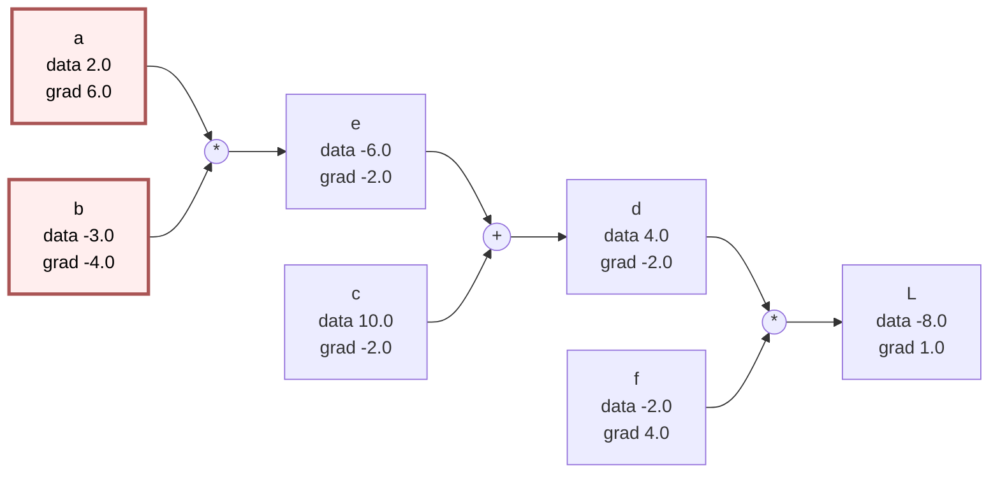

# Backpropagation (Micrograd From Scratch)

**Last Updated**: 2026-05-10
**Source**: Andrej Karpathy — Micrograd from Scratch (Colab walkthrough)
**My Notebook**: [AK_micrograd_from_scratch.ipynb (Colab)](https://colab.research.google.com/drive/1NV4JjkmLt1WBMlW16a-Zba5ZdxXWgqMS?authuser=1#scrollTo=YcuJT6pgXMve)

---

## 1. Core Concept

Backpropagation is an efficient algorithm for computing the gradient of a scalar loss with respect to every parameter in a computation graph by applying the chain rule in reverse topological order. Each node stores its forward output (`data`) and the local gradient (`grad`), and gradients flow backward from the loss node to the inputs. Modern autograd engines (PyTorch, JAX, TensorFlow) are essentially scaled-up versions of micrograd.

---

## 2. Key Interview Points

- A neural network is just a math expression — backprop = chain rule applied recursively over its computation graph.
- Each `Value` node knows: its data, its children, the op that produced it, and a `_backward` closure that distributes the upstream gradient to children.
- ⚠️ **Plus node routes gradients unchanged**: `d/dx (x+y) = 1`, so addition simply copies the upstream gradient to both children.
- ⚠️ **Multiply node swaps the inputs**: in `z = x*y`, `dz/dx = y` and `dz/dy = x`. Common interview slip-up.
- ⚠️ **Always accumulate (`+=`) gradients**, never overwrite — a node may be used in multiple downstream paths (multivariate chain rule).
- Numerical derivative `(f(x+h) - f(x))/h` is a sanity-check tool, not the production method (slow, unstable).
- Gradient = sensitivity. `dL/dx` answers: "if I nudge x slightly, how much does L change?"

---

## 3. Math / Formulas

**Numerical derivative (definition)**:

```
f'(x) ≈ (f(x+h) - f(x)) / h    as h → 0
```

**Sum rule** (addition node):

```
d = c + e   ⇒   ∂d/∂c = 1,   ∂d/∂e = 1
```

**Product rule** (multiplication node):

```
e = a * b   ⇒   ∂e/∂a = b,   ∂e/∂b = a
```

**Chain rule** (the engine of backprop):

```
dL/dx = dL/dy · dy/dx
```

For a deeper chain `c → e → d → L`:

```
dL/dc = dL/dd · dd/de · de/dc
```

---

## 4. Worked Example (from the notebook)

**Forward pass**:

```
a = 2.0,  b = -3.0,  c = 10.0,  f = -2.0
e = a * b      = -6.0
d = e + c      =  4.0
L = d * f      = -8.0
```

**Backward pass** (compute every `dL/dx`):

| Node | Local rule | Calculation | Gradient |
|------|-----------|-------------|----------|
| L    | seed       | dL/dL = 1                    | 1.0  |
| f    | dL/df = d  | = 4.0                        | 4.0  |
| d    | dL/dd = f  | = -2.0                       | -2.0 |
| c    | + node, route | dL/dd · 1 = -2 · 1        | -2.0 |
| e    | + node, route | dL/dd · 1 = -2 · 1        | -2.0 |
| a    | mul, swap  | dL/de · b = -2 · -3 =  6     |  6.0 |
| b    | mul, swap  | dL/de · a = -2 ·  2 = -4     | -4.0 |

**Verification**: nudge `a` by `h = 0.0001`. `L` should change by `~6h`. This matches numerical derivative ≈ 6.

**Computation graph** (forward `data` + backward `grad` annotated on each node):



**Reading the graph**: forward (left → right) computes `data`. Backward (right → left) starts with `L.grad = 1` and propagates gradients via local rules — `*` swaps and multiplies, `+` routes unchanged.

---

## 4b. Step-by-Step Backward Pass — Hand vs Code

Same example, walked one step at a time. Left column = math by hand; right column = what the `Value` class actually executes. Highlighted nodes are the ones whose `grad` was just updated.

### Step 1 — Forward done, all grads = 0

| Hand | Code |
|------|------|
| Compute `e=-6, d=4, L=-8` | Each `__add__` / `__mul__` returned a new `Value` with `data` set and a `_backward` closure stored. |



### Step 2 — Seed `L.grad = 1`

| Hand | Code |
|------|------|
| `dL/dL = 1` | `self.grad = 1.0` (inside `backward()`) |



### Step 3 — `L._backward()` runs (mul: `d * f`)

| Hand | Code |
|------|------|
| `dL/dd = f = -2`<br/>`dL/df = d = 4` | `d.grad += f.data * L.grad = -2`<br/>`f.grad += d.data * L.grad = 4` |



### Step 4 — `d._backward()` runs (add: `e + c`)

| Hand | Code |
|------|------|
| `dL/de = dL/dd · 1 = -2`<br/>`dL/dc = dL/dd · 1 = -2` | `e.grad += 1.0 * d.grad = -2`<br/>`c.grad += 1.0 * d.grad = -2` |



### Step 5 — `e._backward()` runs (mul: `a * b`)

| Hand | Code |
|------|------|
| `dL/da = dL/de · b = -2·-3 = 6`<br/>`dL/db = dL/de · a = -2·2 = -4` | `a.grad += b.data * e.grad = 6`<br/>`b.grad += a.data * e.grad = -4` |



Leaves (`a, b, c, f`) have `_backward = lambda: None`, so the remaining loop iterations are no-ops. Backward pass complete.

### Hand → Code mapping

| Hand action | Code mechanism |
|-------------|----------------|
| Apply local derivative rule | The closure stored in `_backward` |
| Multiply by upstream gradient | `* out.grad` inside the closure |
| Push into input variable | `self.grad += ...` and `other.grad += ...` |
| Walk backward from L | `for node in reversed(topo): node._backward()` |
| Sum contributions if path forks | `+=` (accumulate, never overwrite) |

---

## 5. Senior-Level Points

- **Reverse-mode AD vs forward-mode**: backprop is reverse-mode, optimal when outputs ≪ inputs (typical in ML — one scalar loss, millions of params). Forward-mode is better when inputs ≪ outputs.
- **Topological order matters**: `_backward` must be called on children only after parents — otherwise upstream `out.grad` is zero. Real autograd engines do a topological sort before invoking backwards.
- **Gradient accumulation** is why PyTorch needs `optimizer.zero_grad()` — grads accumulate across backward passes by default.
- **Memory cost**: forward pass must save activations needed for backward; this is why activation checkpointing trades compute for memory in deep nets.
- **Numerical stability**: composition of many ops can underflow/overflow gradients (vanishing/exploding gradient problem) — motivates ReLU, batch norm, residual connections, careful init.
- **Static vs dynamic graphs**: TF1 / JAX trace a graph once (faster, harder to debug); PyTorch / micrograd build it on every forward pass (slower, easier to debug, supports control flow).

---

## 6. Production Monitoring

- **Gradient norms per layer**: log `‖∇W_l‖` during training. Sudden spikes → exploding grads (clip them); decay to 0 → vanishing grads (re-init, change activation, add residuals).
- **NaN/Inf in grads**: usually traces to log(0), divide-by-zero, sqrt of negative, or bad mixed-precision casts. Add `torch.autograd.detect_anomaly()` in dev runs.
- **Gradient-to-weight ratio** (`‖∇W‖ / ‖W‖`): healthy range ~1e-3. Too small = no learning; too large = unstable updates.
- **Dead neurons**: monitor activation sparsity — ReLU layers stuck at 0 contribute zero gradient and never recover.
- **Checkpointing strategy**: in large models, recompute activations during backward instead of storing — trades ~30% extra compute for major memory savings.

---

## 7. Interview-Ready Summary

> Backpropagation is just the chain rule applied recursively over a computation graph. Every operation in the forward pass becomes a node; in the backward pass, we walk the graph in reverse topological order and, at each node, multiply the upstream gradient by the local derivative of that op. Plus nodes route gradients unchanged, multiplication nodes swap and multiply, and gradients accumulate when a variable is used in multiple paths. That's why a 200-line micrograd in pure Python implements the same idea as PyTorch's autograd — only PyTorch operates on tensors and runs on GPUs.

---

## 8. FAQ Bank

### L1 — Foundational

**Q: Why do we need backpropagation? Can't we just use numerical gradients?**
A: Numerical gradients require one forward pass per parameter (`O(n)` extra forward passes), so for a network with millions of weights, it's intractable. Backprop computes all gradients in a single backward pass — total cost ≈ 2× a forward pass — by reusing intermediate values via the chain rule.

**Q: What is a computation graph?**
A: A DAG where each node is a value (input, parameter, or intermediate result) and each edge represents a dependency through some operation. Forward pass evaluates nodes in topological order; backward pass walks the same graph in reverse to compute gradients.

**Q: What does the `+` node do in backprop?**
A: It distributes the upstream gradient unchanged to all its inputs, because `∂(a+b)/∂a = ∂(a+b)/∂b = 1`.

### L2 — Intermediate

**Q: Why do we use `+=` instead of `=` when assigning gradients?**
A: A variable might feed into multiple downstream nodes. The total gradient is the sum of contributions along all paths (multivariate chain rule). Overwriting would discard earlier contributions.

**Q: What's the role of `_backward` in micrograd?**
A: Each `Value` stores a closure that knows how to push the upstream `out.grad` to its children given the local derivative of the op that produced it. Calling `_backward` in reverse topological order from the loss propagates gradients to every leaf.

**Q: Why is topological order required?**
A: A node's `out.grad` is the sum of contributions from all of its parents. We can only call its `_backward` after every parent has finished — otherwise the upstream gradient is incomplete or zero.

### L3 — Advanced

**Q: Reverse-mode vs forward-mode AD — when do you pick which?**
A: Reverse-mode (backprop) costs `O(forward) + O(forward)` to compute the gradient of one scalar wrt many inputs — ideal for ML loss landscapes. Forward-mode costs `O(forward)` per input dimension — better for Jacobians where you have few inputs and many outputs (e.g., physics simulations).

**Q: How does activation checkpointing change the backward pass?**
A: Instead of storing every forward activation, you store only a sparse subset and recompute the rest during backward. Trades ~30% extra compute for sub-linear memory in depth — essential for training long-context transformers.

**Q: How is autograd different from symbolic differentiation?**
A: Symbolic differentiation produces a closed-form derivative expression (can blow up combinatorially for deep nets). Autograd records the operations that ran during the forward pass and applies known local derivatives at each node — no symbolic expansion, so it scales linearly with the size of the computation graph.

**Q: How does gradient checkpointing interact with `torch.no_grad()` and `requires_grad`?**
A: `torch.no_grad()` disables graph construction entirely (no backward possible). Checkpointing keeps `requires_grad=True` but discards intermediate activations and rebuilds the sub-graph on demand during backward — stitched together via `torch.utils.checkpoint`.

---

## 9. The `Value` Class — Minimal Autograd in Python

The mental model in code (from the notebook):

```python
class Value:
    def __init__(self, data, _children=(), _op='', label=''):
        self.data = data
        self.grad = 0.0
        self._backward = lambda: None
        self._prev = set(_children)
        self._op = _op
        self.label = label

    def __add__(self, other):
        out = Value(self.data + other.data, (self, other), '+')
        def _backward():
            self.grad  += 1.0 * out.grad   # plus routes unchanged
            other.grad += 1.0 * out.grad
        out._backward = _backward
        return out

    def __mul__(self, other):
        out = Value(self.data * other.data, (self, other), '*')
        def _backward():
            self.grad  += other.data * out.grad   # swap and multiply
            other.grad += self.data  * out.grad
        out._backward = _backward
        return out
```

To run the full backward pass automatically (next step beyond the notebook): topologically sort the graph from the loss, then call `_backward` on each node in reverse.

---

## 10. Resources

| Type | Resource | URL |
|---|---|---|
| Watch | Andrej Karpathy — *The spelled-out intro to neural networks and backpropagation: building micrograd* | https://www.youtube.com/watch?v=VMj-3S1tku0 |
| Code  | karpathy/micrograd repo | https://github.com/karpathy/micrograd |
| Read  | CS231n — Backpropagation, Intuitions | https://cs231n.github.io/optimization-2/ |
| Read  | Chris Olah — Calculus on Computational Graphs | https://colah.github.io/posts/2015-08-Backprop/ |
| Watch | 3Blue1Brown — What is backpropagation really doing? | https://www.youtube.com/watch?v=Ilg3gGewQ5U |
| Paper | Rumelhart, Hinton, Williams (1986) — Learning representations by back-propagating errors | https://www.nature.com/articles/323533a0 |
